# Cyber4s 3rd Pre-Course Final Project

## What we will be building

Welcome to your pre-course final project. You are going to build a task-management application.

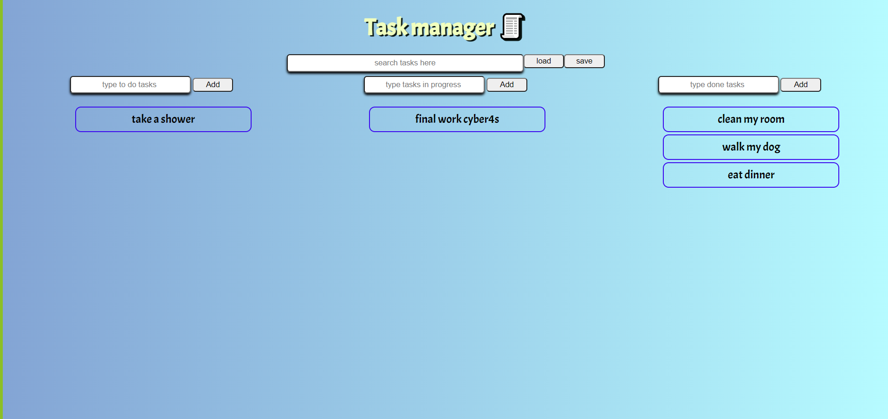

Welcome!

In this screen shot you can see i added some tasks for example.
the features included in this website are:

# You can add new tasks by writing the task in the input and pressing the add button:

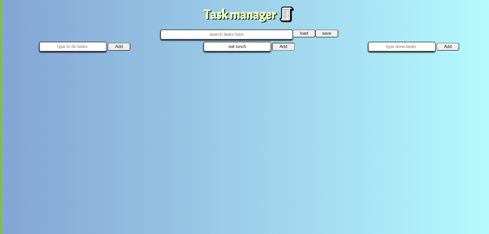 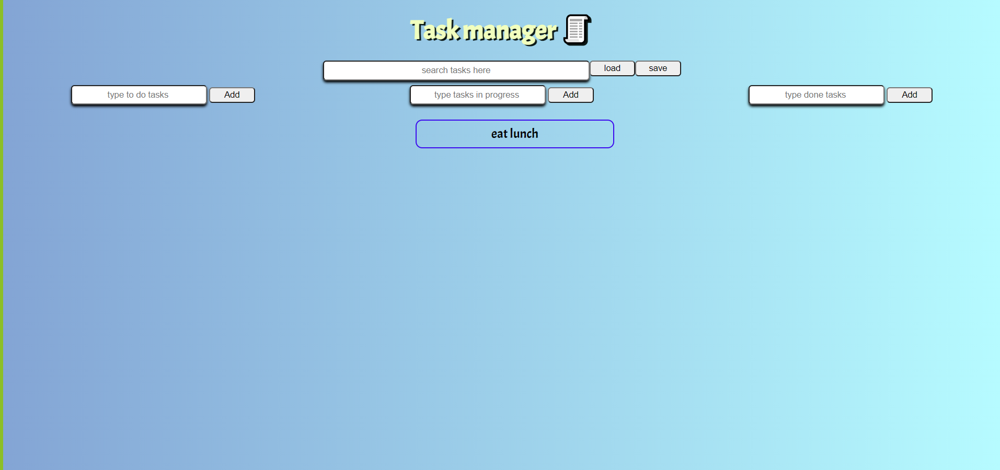

### When the user click on add button without type a text, an alert message will appear

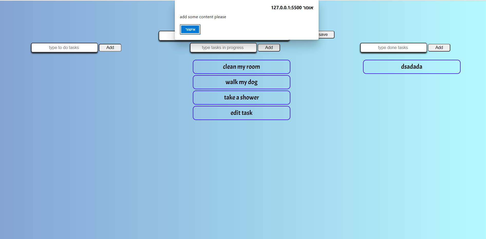

### You can re-edit a task by double clicking the task you want to add.

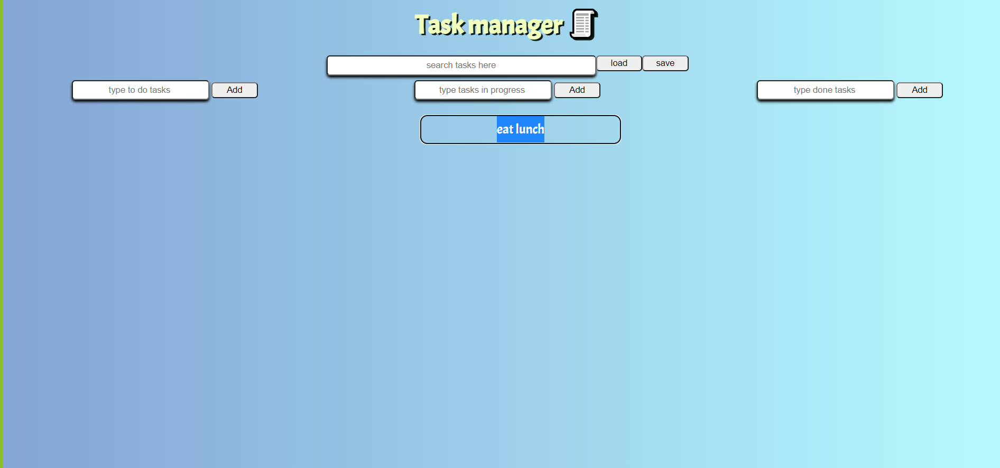 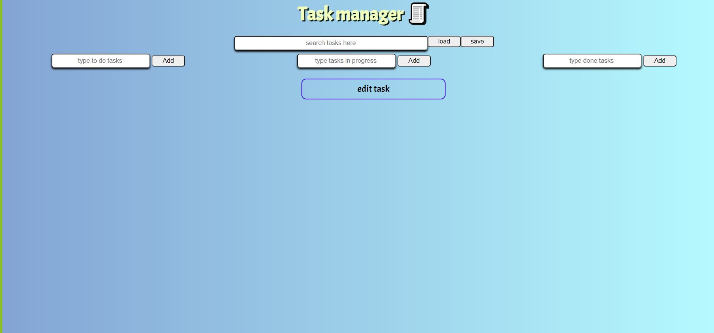

### You can move tasks from one list to another by clicking the wanted task and then pressing "alt+ number"

the number should be 1,2 or 3 depending on the list you want to be the destination.
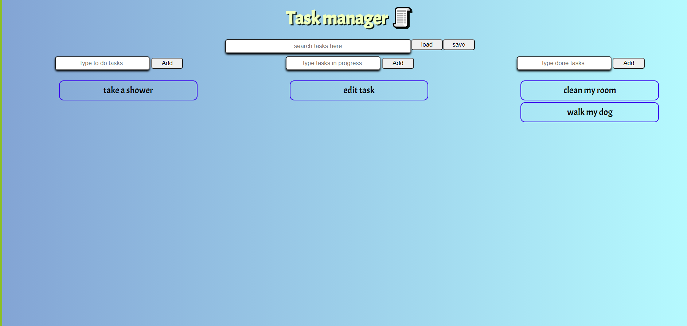 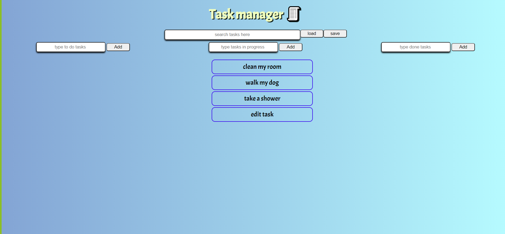

### A global search bar that shows you only the tasks that includes the characters written inside the input.

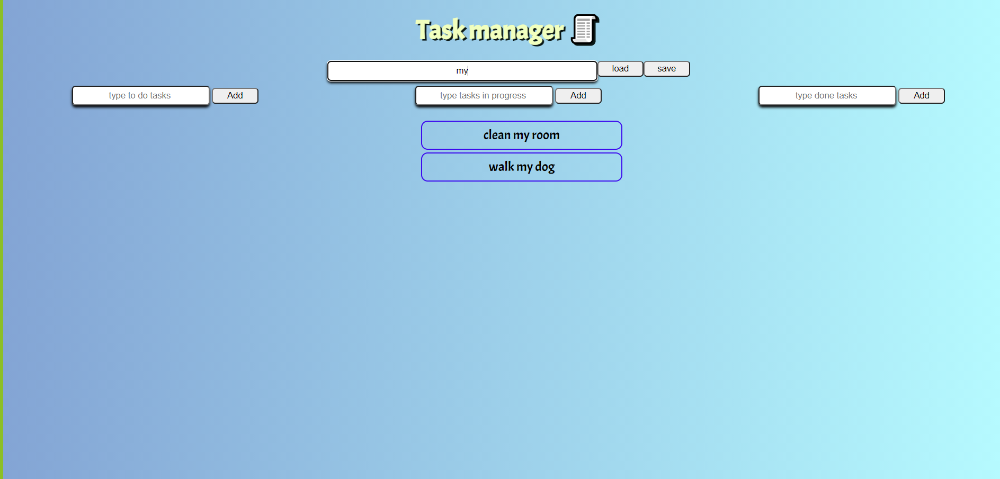

## Bonus

### The user allowed to drag tasks and drop them in another lists.

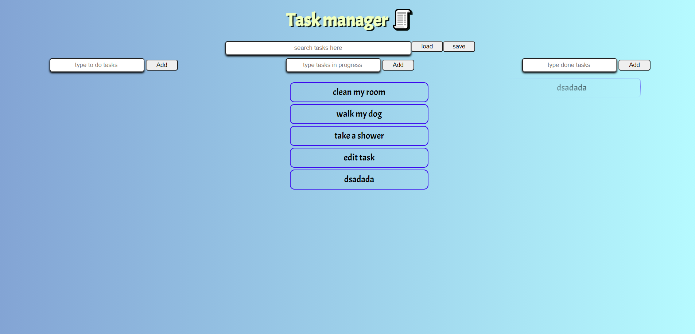 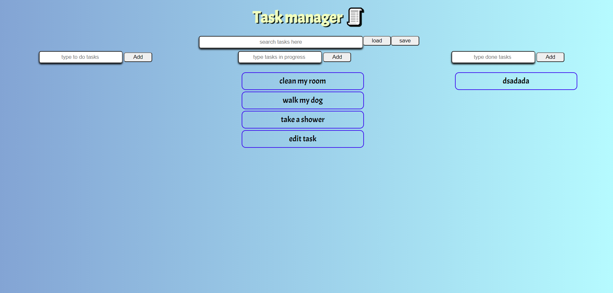

### The user is able to save the data in this api https://json-bins.herokuapp.com/bin/614af9534021ac0e6c080cbf

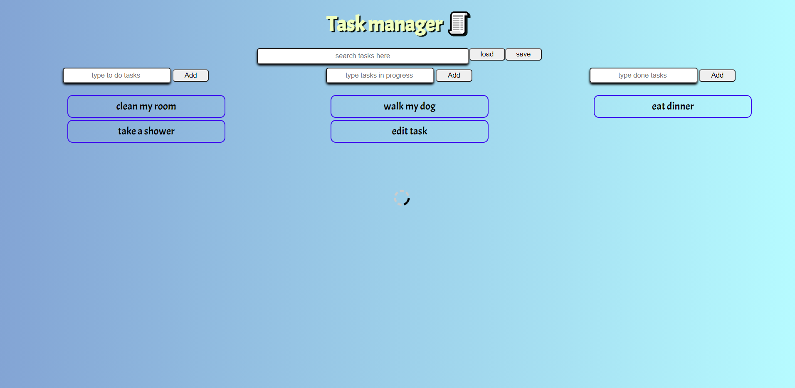 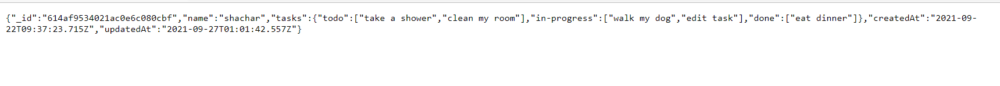
